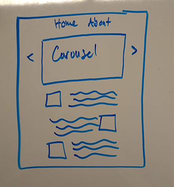
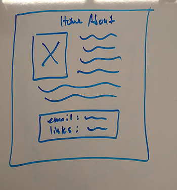
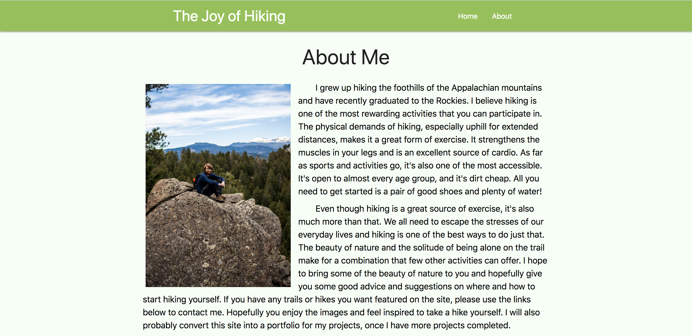

# Personal Site
This is a website built to showcase my personal projects. Enjoy text, images and other technological marvels. Explore your choice of *two* pages and experience the web in all its glory 📡.

## Wireframe

The index turned out pretty close to the wireframe. I ended up deciding to go with a slider instead of a carousel.

The About Me page turned out well, I did make some adjustments to the contact box at the bottom though.

## Sreenshot
If your site loads correctly, it should look something like this:

## Built With
* [Materialize](https://materializecss.com/) - CSS Framework
* ~~Love~~

## Deployment
Deployed with surge: 

## Author
* Bill Bain - [bainwa](https://github.com/bainwa)